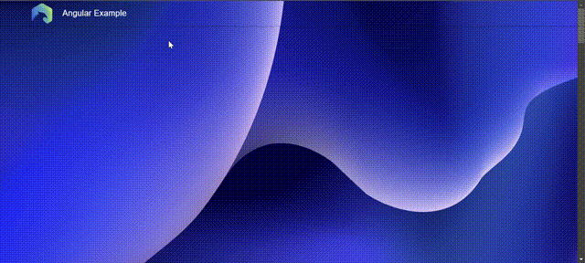

# Ionic Angular with SSR and some architecture

- Components
- Pipes
- Directives
- Services



## Project Specifications:

This project discuss angular architecture in a simple way with a server side rendering to optimize seo .


## Tools:

- [Tailwindcss](https://tailwindcss.com/)
- [UiKit](https://getuikit.com/)
- [Angular Material](https://material.angular.io/)
- [Ngx-translate](https://github.com/ngx-translate/core)


## Environment 
- Node Version: ^12.18.2
- Ionic Version: 6
- Angular Version: 15


**Commands**

- install:
```bash
npm install
```
- run: 
```bash
npm start
```
- build:
```bash
npm build
```
- build production:
```bash
npm build:production
```
- serve ssr:
```bash
npm dev:ssr
```

- build ssr:
```bash
npm build:ssr
```

- run ssr:
```bash
npm serve:ssr
```

- test: 
```bash
npm test
```
